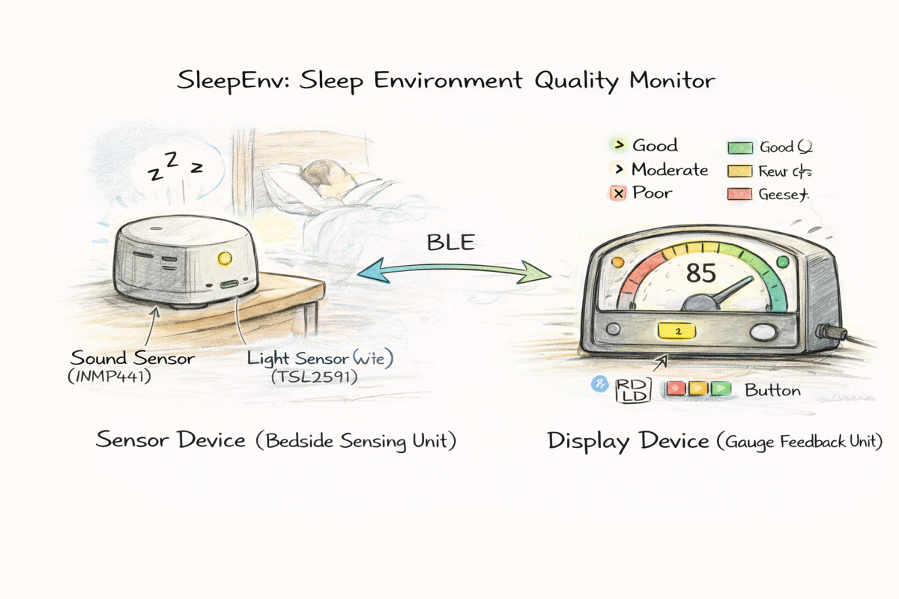
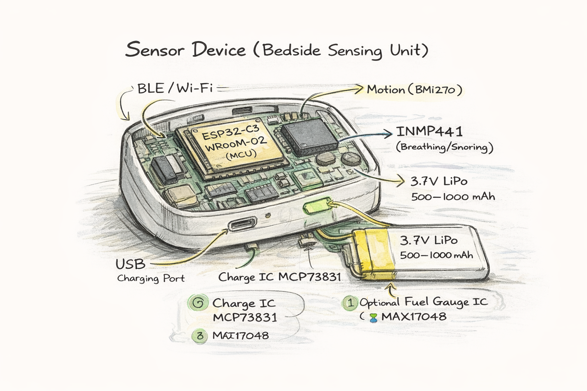
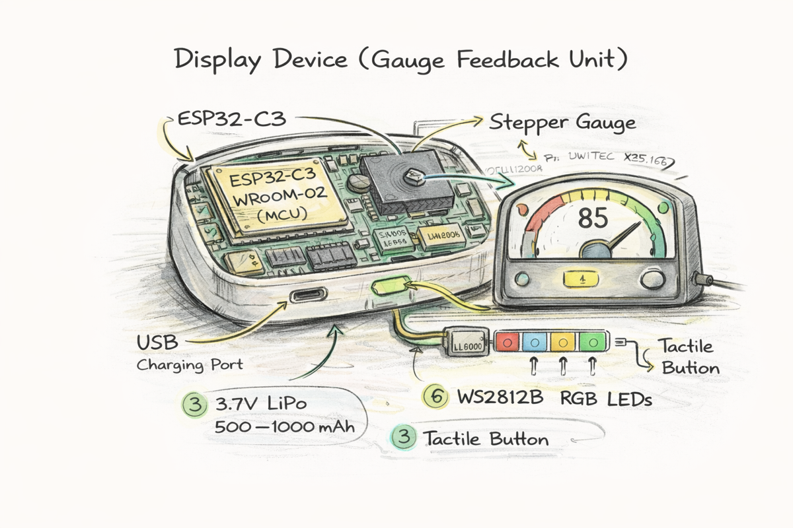
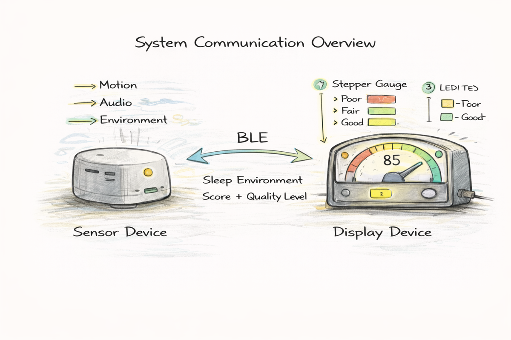
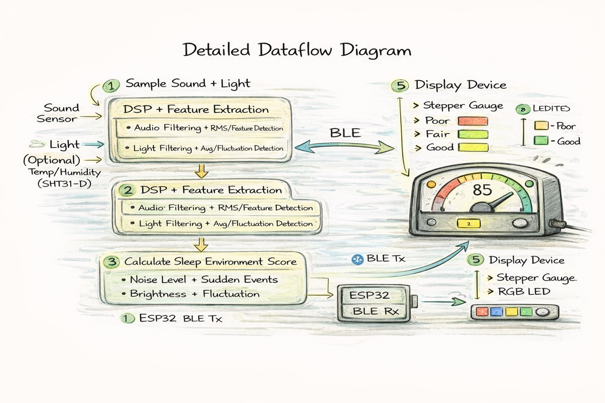

# SleepEnv: Sleep Environment Quality Monitor

SleepEnv is a two-device system that evaluates whether the surrounding environment is suitable for high-quality sleep. A bedside sensing device measures environmental noise and light levels, processes the data using signal processing and scoring algorithms, and wirelessly sends a sleep environment quality rating (Good / Moderate / Poor) to a physical display device with a gauge and LEDs.

**General Sketch (Physical Overview)**  

---

## 1) Sensor Device — Bedside Sensing Unit

**Description**  
The sensor device is placed near the bed to continuously monitor environmental conditions that affect sleep quality. It captures sound and ambient light data, performs basic digital signal processing and feature extraction, and transmits a sleep environment score to the display device via Bluetooth Low Energy (BLE).

**Main Components (with Part Numbers)**  
- MCU + Wireless: **ESP32-C3-WROOM-02** (BLE communication and data processing)
- Sound Sensor (Digital Microphone): **INMP441**  
  - Used to measure ambient noise level and detect sudden noise events
- Ambient Light Sensor: **TSL2591**  
  - Used to measure room brightness and light fluctuations
- Battery Charger IC: **MCP73831**
- Voltage Regulator: **AP2112K-3.3**
- Battery: 3.7V LiPo battery (500–1000 mAh)

**How It Works**  
The ESP32 samples audio and light data at regular intervals. Audio signals are processed to estimate noise level and detect sudden disturbances, while light data is filtered to compute average brightness and fluctuation. These features are combined into an environment quality score, which is sent to the display device using BLE.

**Detailed Sensor Device Sketch**  

---

## 2) Display Device — Gauge Feedback Unit

**Description**  
The display device receives processed sleep environment data from the sensor device and provides intuitive feedback using a physical gauge needle, RGB LEDs, and a button. It allows users to quickly understand whether their current environment is suitable for sleep.

**Main Components (with Part Numbers)**  
- MCU + Wireless: **ESP32-C3-WROOM-02**
- Stepper Motor Gauge: **Switec X25.168**
- Stepper Driver: **ULN2003A**
- RGB LED: **WS2812B**
- Button: 6×6 mm tactile push button
- Battery Charger IC: **MCP73831**
- Voltage Regulator: **AP2112K-3.3**
- Battery: 3.7V LiPo battery (1000–2000 mAh)

**How It Works**  
The ESP32 receives the environment quality score via BLE and maps it to a gauge needle position (0–100). The RGB LED displays color-coded feedback: green for Good, yellow for Moderate, and red for Poor. The button allows the user to switch display modes or recalibrate the system.

**Detailed Display Device Sketch**  

---

## 3) Communication and System Diagrams

**Figure A — BLE Communication Overview**  

**Figure B — Detailed Dataflow Diagram**  

**System Dataflow Explanation**  
1. The sensor device samples audio and light signals (and optional temperature/humidity).
2. Digital signal processing is applied, including filtering, windowing, and feature extraction.
3. A sleep environment quality score (0–100) is calculated and classified as Good, Moderate, or Poor.
4. The score and status are transmitted to the display device via BLE.
5. The display device drives the stepper motor gauge and RGB LED, and responds to user input from the button.